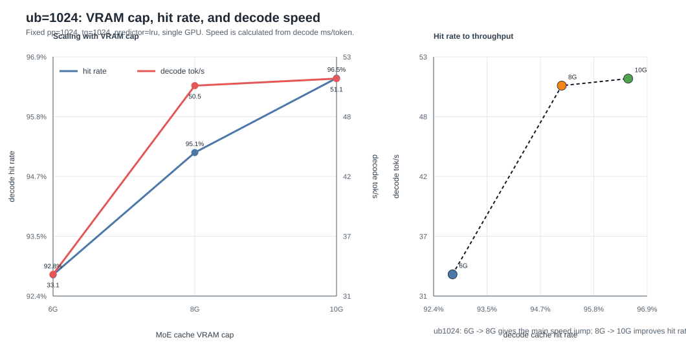
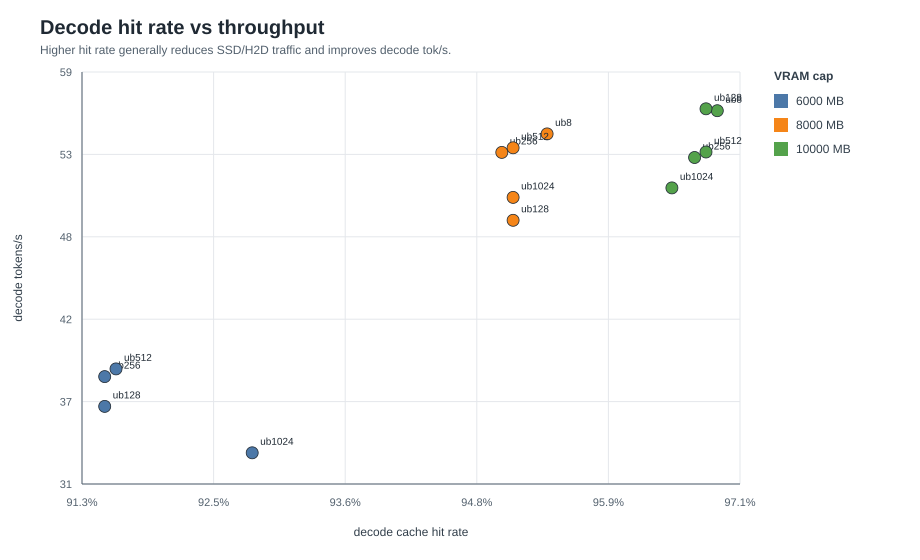
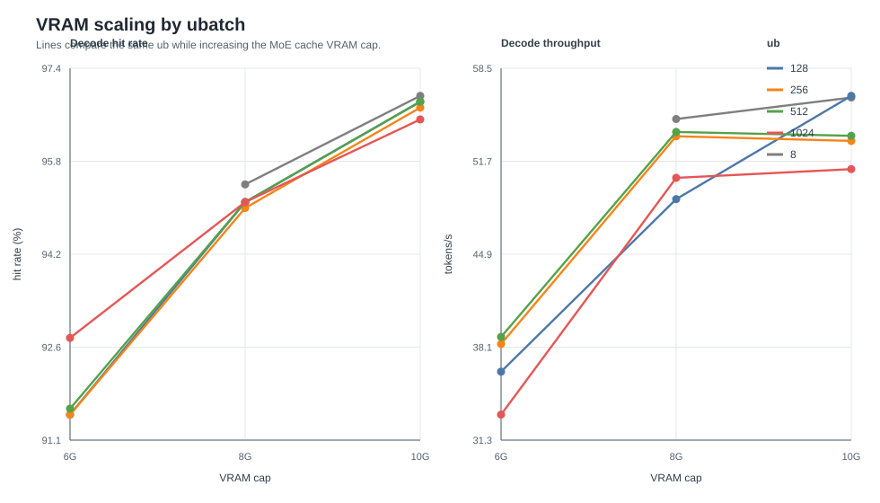
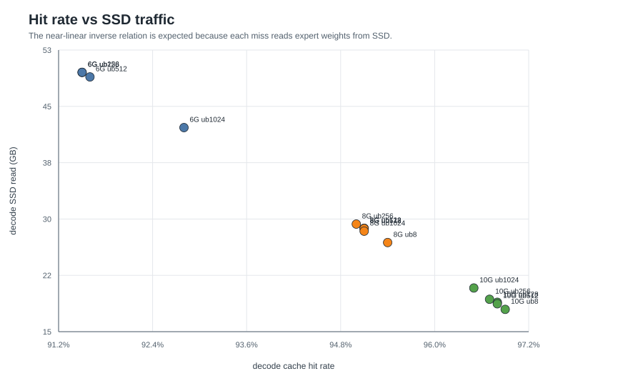
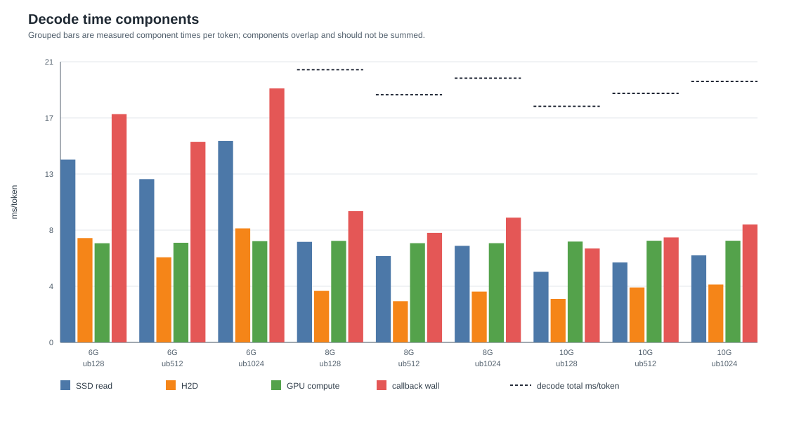
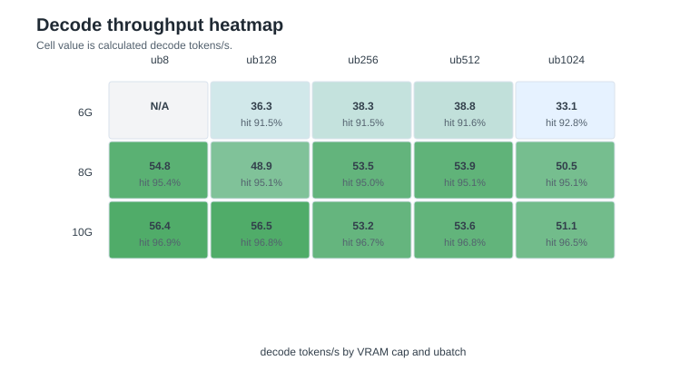

# Decode cache hit rate vs throughput

数据来源：`benchmark-results/new-result/vram-6000`、`vram-8000`、`vram-10000` 的 summary。固定条件为 normal prompt、`pp=1024`、`tg=1024`、`ctx=4096`、`predictor=lru`、单卡 `CUDA_VISIBLE_DEVICES=0`。

注意：6G 主矩阵里没有 `ub=8`；6G 的 `ub512/ub1024` 另有公平复测结果，见文末说明。

## Charts

图表文件放在 `plots/`，由 `generate_charts.py` 根据 `decode_hit_rate_toks.tsv` 生成。

`ub=1024` 下，6G 到 8G 是主要收益区间：decode hit rate 从 `92.8%` 提升到 `95.1%`，decode tok/s 从 `33.12` 提升到 `50.48`。8G 到 10G 的 hit rate 继续到 `96.5%`，但 tok/s 只到 `51.12`，说明此时 SSD miss 已经不是唯一瓶颈，GPU compute、调度、callback 路径和 H2D overlap 共同限制 decode。

注意：上图的 component bars 是不同统计口径下的每 token 时间，callback、SSD read、H2D、GPU compute 之间存在包含或 overlap，不能相加得到 decode total。

## Full Data

| VRAM MB | ub | decode hit | decode ms/tok | decode tok/s | SSD GB | SSD MB/tok | SSD ms/tok | H2D ms/tok | GPU ms/tok | callback ms/tok | VRAM peak GB |
|---:|---:|---:|---:|---:|---:|---:|---:|---:|---:|---:|---:|
| 6000 | 128 | 91.5% | 27.57 | 36.27 | 49.63 | 49.63 | 13.70 | 7.82 | 7.43 | 17.11 | 8.92 |
| 6000 | 256 | 91.5% | 26.11 | 38.30 | 49.64 | 49.64 | 12.55 | 6.61 | 7.43 | 15.54 | 9.04 |
| 6000 | 512 | 91.6% | 25.76 | 38.82 | 49.03 | 49.03 | 12.24 | 6.38 | 7.47 | 15.04 | 9.25 |
| 6000 | 1024 | 92.8% | 30.19 | 33.12 | 42.22 | 42.22 | 15.10 | 8.55 | 7.59 | 19.04 | 9.74 |
| 8000 | 8 | 95.4% | 18.25 | 54.79 | 26.78 | 26.78 | 6.21 | 2.97 | 7.37 | 8.03 | 10.90 |
| 8000 | 128 | 95.1% | 20.44 | 48.92 | 28.70 | 28.70 | 7.54 | 3.86 | 7.61 | 9.84 | 11.02 |
| 8000 | 256 | 95.0% | 18.68 | 53.53 | 29.26 | 29.26 | 6.57 | 2.95 | 7.42 | 8.37 | 11.14 |
| 8000 | 512 | 95.1% | 18.57 | 53.85 | 28.66 | 28.66 | 6.47 | 3.09 | 7.44 | 8.21 | 11.36 |
| 8000 | 1024 | 95.1% | 19.81 | 50.48 | 28.31 | 28.31 | 7.24 | 3.81 | 7.44 | 9.35 | 11.85 |
| 10000 | 8 | 96.9% | 17.74 | 56.37 | 17.81 | 17.81 | 5.27 | 3.12 | 7.53 | 7.08 | 12.91 |
| 10000 | 128 | 96.8% | 17.70 | 56.50 | 18.76 | 18.76 | 5.29 | 3.26 | 7.56 | 7.04 | 13.03 |
| 10000 | 256 | 96.7% | 18.80 | 53.19 | 19.16 | 19.16 | 6.15 | 4.23 | 7.60 | 8.10 | 13.15 |
| 10000 | 512 | 96.8% | 18.67 | 53.56 | 18.55 | 18.55 | 5.99 | 4.12 | 7.62 | 7.87 | 13.36 |
| 10000 | 1024 | 96.5% | 19.56 | 51.12 | 20.68 | 20.68 | 6.53 | 4.34 | 7.62 | 8.84 | 13.86 |

## Same-ub Scaling

### ub=8

| VRAM | hit | tok/s | ms/tok | SSD GB | SSD ms/tok | H2D ms/tok |
|---:|---:|---:|---:|---:|---:|---:|
| 8000 | 95.4% | 54.79 | 18.25 | 26.78 | 6.21 | 2.97 |
| 10000 | 96.9% | 56.37 | 17.74 | 17.81 | 5.27 | 3.12 |

从 8000MB 到 10000MB：hit +1.5 pct points，tok/s +2.9%，ms/token 降低 2.8%，decode SSD read 降低 33.5%，ssd_read ms/token 降低 15.1%，H2D ms/token 降低 -5.1%。

### ub=128

| VRAM | hit | tok/s | ms/tok | SSD GB | SSD ms/tok | H2D ms/tok |
|---:|---:|---:|---:|---:|---:|---:|
| 6000 | 91.5% | 36.27 | 27.57 | 49.63 | 13.70 | 7.82 |
| 8000 | 95.1% | 48.92 | 20.44 | 28.70 | 7.54 | 3.86 |
| 10000 | 96.8% | 56.50 | 17.70 | 18.76 | 5.29 | 3.26 |

从 6000MB 到 10000MB：hit +5.3 pct points，tok/s +55.8%，ms/token 降低 35.8%，decode SSD read 降低 62.2%，ssd_read ms/token 降低 61.4%，H2D ms/token 降低 58.3%。

### ub=256

| VRAM | hit | tok/s | ms/tok | SSD GB | SSD ms/tok | H2D ms/tok |
|---:|---:|---:|---:|---:|---:|---:|
| 6000 | 91.5% | 38.30 | 26.11 | 49.64 | 12.55 | 6.61 |
| 8000 | 95.0% | 53.53 | 18.68 | 29.26 | 6.57 | 2.95 |
| 10000 | 96.7% | 53.19 | 18.80 | 19.16 | 6.15 | 4.23 |

从 6000MB 到 10000MB：hit +5.2 pct points，tok/s +38.9%，ms/token 降低 28.0%，decode SSD read 降低 61.4%，ssd_read ms/token 降低 51.0%，H2D ms/token 降低 36.0%。

### ub=512

| VRAM | hit | tok/s | ms/tok | SSD GB | SSD ms/tok | H2D ms/tok |
|---:|---:|---:|---:|---:|---:|---:|
| 6000 | 91.6% | 38.82 | 25.76 | 49.03 | 12.24 | 6.38 |
| 8000 | 95.1% | 53.85 | 18.57 | 28.66 | 6.47 | 3.09 |
| 10000 | 96.8% | 53.56 | 18.67 | 18.55 | 5.99 | 4.12 |

从 6000MB 到 10000MB：hit +5.2 pct points，tok/s +38.0%，ms/token 降低 27.5%，decode SSD read 降低 62.2%，ssd_read ms/token 降低 51.1%，H2D ms/token 降低 35.4%。

### ub=1024

| VRAM | hit | tok/s | ms/tok | SSD GB | SSD ms/tok | H2D ms/tok |
|---:|---:|---:|---:|---:|---:|---:|
| 6000 | 92.8% | 33.12 | 30.19 | 42.22 | 15.10 | 8.55 |
| 8000 | 95.1% | 50.48 | 19.81 | 28.31 | 7.24 | 3.81 |
| 10000 | 96.5% | 51.12 | 19.56 | 20.68 | 6.53 | 4.34 |

从 6000MB 到 10000MB：hit +3.7 pct points，tok/s +54.3%，ms/token 降低 35.2%，decode SSD read 降低 51.0%，ssd_read ms/token 降低 56.8%，H2D ms/token 降低 49.2%。

## Correlation

全体样本（n=14）中，decode hit rate 与 decode tok/s 的 Pearson r = `0.909`；与 decode ms/token 的 r = `-0.886`；与 decode SSD read GB 的 r = `-1.000`；与 ssd_read ms/token 的 r = `-0.921`；与 H2D ms/token 的 r = `-0.806`。

只看共同 ub=128/256/512/1024（n=12）时，hit rate 与 tok/s 的 r = `0.907`；hit rate 与 SSD read 的 r = `-1.000`。

## Interpretation

- VRAM cache 从 6000MB 增到 8000MB，再到 10000MB，decode hit rate 明显上升：6G 约 `91.5-92.8%`，8G 约 `95.0-95.4%`，10G 约 `96.5-96.9%`。
- hit rate 增长主要通过减少 expert miss 的 SSD/H2D 权重搬运来提升 decode：decode SSD read 从 6G 的约 `42-50GB` 降到 8G 的约 `27-29GB`，再降到 10G 的约 `18-21GB`。
- 速度提升不是线性关系。hit rate 从 95% 到 97% 的绝对提升只有约 2 pct points，但由于剩余 miss 已经很少，收益会逐渐进入边际递减区；decode 仍受 GPU compute、slot table/topk、调度和 I/O overlap 影响。
- 同一 VRAM 下，ub 会改变 prefill 结束后的 cache 末态，因此 decode hit 和速度不是只由 VRAM 决定。例如 10G 下 `ub=8/128` 的 decode 比 `ub=1024` 更快，虽然它们的 hit rate 差距只有 `0.4 pct points`。
- 以共同 ub 对比，8G 相比 6G 的提升最大；10G 相比 8G 继续减少 SSD read，但 tok/s 提升幅度变小。

## Fair Retest Note

6G 的 `ub512/ub1024` 主矩阵是单次结果，其中 `ub1024` 曾出现过一次异常慢。公平复测目录 `vram-6000/512vs1024` 显示 `ub1024` 的 decode 均值约 `27.46 ms/token`，`ub512` 约 `28.76 ms/token`。因此报告中的跨 VRAM 趋势应优先看相同测试矩阵的整体方向，不要把单个 run 当作稳定结论。
